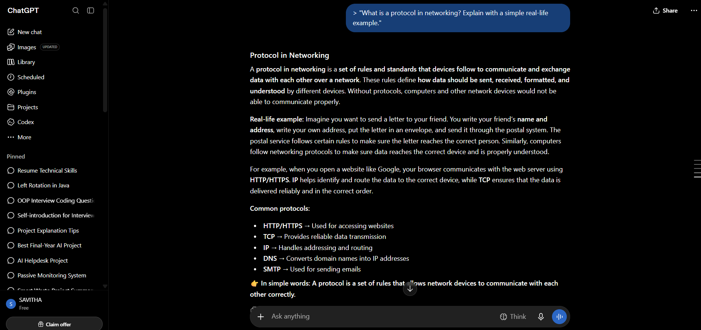

# Week 00 - Internet and Networking

Part of the DevOps Micro Internship (DMI) Cohort 3 with Agentic AI

---

# 🧑‍💻 Task 1: Using ChatGPT as Your Learning Assistant

## Scenario

You're new to DevOps and will frequently encounter technical questions. ChatGPT can be your learning companion.

## Your Task

Write a clear ChatGPT prompt to help you understand:

> "What is a protocol in networking? Explain with a simple real-life example."

Take a screenshot of your interaction showing:

* Your detailed prompt (with clear expectations)
* ChatGPT's simplified response with an example

## Screenshot

Save your screenshot in the `screenshots` folder and update the file name below.




Replace `week 0 (1)` with your actual screenshot file name.

---

## What I Learned (2–3 lines)

I learned that a network protocol is a set of rules that helps devices communicate and exchange data correctly over a network. I also learned about common protocols like HTTP, TCP, IP, and DNS and their basic uses.

---

# 🌐 Task 2: Internet and Networking

## Scenario

Your friend is launching an online bookstore named **EpicReads**.

He asked you to explain how users globally can access his website hosted in Finland.

## Your Task

Write a short explanation (**100–150 words**) that includes:

* Packet Switching
* IP Address
* TCP/IP
* HTTP/HTTPS

💡 **Tip:** You may use ChatGPT (as demonstrated in Task 1) to refine your explanation.

## Answer

When a user anywhere in the world opens the "EpicReads" website hosted in Finland, the data travels across the Internet using "packet switching". The website data is divided into small packets, and each packet can travel through different routes before reaching the user. The "IP address" identifies the destination of the server and the user’s device, helping routers deliver the packets correctly. "TCP/IP" provides the basic communication rules: IP handles addressing and routing, while TCP ensures that packets are delivered reliably and in the correct order. Once the connection is established, the browser uses "HTTP/HTTPS" to request and receive web pages from the EpicReads server. HTTPS also encrypts the communication, helping protect user information such as login details and payment data. This process allows users globally to access EpicReads smoothly and securely.


---

# 🏗️ Task 3: Application Architecture & Stack

## Scenario

EpicReads bookstore has two application versions:

### Two-Tier Application

* Frontend
* Database

### Three-Tier Application

* Frontend
* Backend
* Database

## Your Task

* Draw simple diagrams (hand-drawn or tool-based such as draw.io)
* Label each layer clearly
* List at least two common technologies or tools used for each layer
* Submit a screenshot or photo clearly showing your own drawing

## Diagram Screenshot / Photo

Save your diagram image in the `screenshots` folder and update the file name below.

(three tier.png)


Replace `task-3-diagram.png` with your actual diagram file name.

---

## Technologies Used

### Frontend

HTML, CSS
JavaScript, React.js

### Backend

Node.js, Express.js
Spring Boot

### Database

MySQL
PostgreSQL

---

# 🌍 Task 4: Domain Name & DNS (Basic Concepts)

## Scenario

Your friend's bookstore **EpicReads** is currently accessible through:

```text
52.172.142.222:3000
```

He purchased the domain:

```text
epicreads.com
```

## Your Task

In **50–100 words**, explain in your own words:

1. What is DNS (Domain Name System)?
2. Which DNS record type should be used to connect the domain to the given IP, and why?

## Answer

1. DNS (Domain Name System) is like the phonebook of the Internet. It converts an easy-to-remember domain name such as epicreads.com into the IP address of the server where the website is hosted. To connect epicreads.com to 52.172.142.222.
2. A (Address) record should be used because an A record maps a domain name to an IPv4 address. When a user enters epicreads.com in a browser, DNS finds the corresponding IP address, allowing the browser to connect to the EpicReads server.

---

# 💻 Task 5: Visual Studio Code Setup (Hands-on)

## Your Task

Install Visual Studio Code (if not already installed).

Take a screenshot of your VS Code environment showing:

* Terminal open inside VS Code
* Running a basic command:

### Windows

```powershell
dir
```

### Linux / macOS

```bash
pwd
ls
```

* Your selected VS Code theme clearly visible

⚠️ **Important:** The screenshot must show your username or another identifiable detail to confirm it is your environment.

## Screenshot

Save your screenshot in the `screenshots` folder and update the file name below.


Replace `task-5-vscode.png` with your actual screenshot file name.

---


# 🔗 Task 6: Publish Your Assignment as a LinkedIn Post

## Objective

Publishing on LinkedIn helps you:

* Build your professional online presence
* Reinforce your learning
* Document your DevOps journey publicly

## Your Task

Summarize your answers from Tasks 1–5 into a LinkedIn post.

Clearly structure your post into the following sections:

* ChatGPT
* Internet & Networking
* App Architecture
* DNS
* VS Code Setup

Use the credit note that matches your track:

Add the following credit note at the end of your post **(If you are DMI Cohort 3 student)**:

> **P.S. This post is part of the DevOps Micro Internship (DMI) with Agentic AI — Cohort 3 — by Pravin Mishra. My graded progress is public: https://dmi.pravinmishra.com/s/Savitha20-06.html · Start your DevOps journey: https://dmi.pravinmishra.com/?utm_source=student&utm_medium=ps-linkedin&utm_campaign=cohort3**


Add the following credit note at the end of your post **(If you are DMI Self-paced track student)**:

> **P.S. This post is part of the DevOps Micro Internship (DMI) — Self-Paced Engineer Track — by Pravin Mishra. My graded progress is public: https://dmi.pravinmishra.com/s/Savitha20-06.html · Start your DevOps journey: https://dmi.pravinmishra.com/?utm_source=student&utm_medium=ps-linkedin&utm_campaign=self-paced**

Add the following credit note at the end of your post **(If you are DMI Campus student)**:

> **P.S. This post is part of the DevOps Micro Internship (DMI) — Campus — by Pravin Mishra. My graded progress is public: https://dmi.pravinmishra.com/s/Savitha20-06.html · Start your DevOps journey: https://dmi.pravinmishra.com/?utm_source=student&utm_medium=ps-linkedin&utm_campaign=campus**

Replace `Savitha20-06` with your GitHub username — that link is your public DMI progress page (your graded badge page).
---

## LinkedIn Post URL

Paste your LinkedIn post URL here:

https://lnkd.in/p/gQ9Gn3Xd

---

## LinkedIn Post Backup Copy

🚀 Week 0 – DevOps Micro Internship | Learning Journey
I started my DevOps Micro Internship journey by learning some important fundamentals of software development and networking.
◆ ChatGPT
I learned how ChatGPT can be used as a learning assistant to understand technical concepts, improve explanations, and refine my work.
◆ Internet & Networking
I learned about network protocols, packet switching, IP addresses, TCP/IP, and HTTP/HTTPS. I understood how data travels between users and servers over the Internet.
◆ App Architecture
I learned the difference between Two-Tier and Three-Tier architecture. Two-Tier consists of Frontend and Database, while Three-Tier separates the application into Frontend, Backend, and Database layers.
◆ DNS
I learned that DNS (Domain Name System) converts human-readable domain names into IP addresses. I also learned that an A record is used to connect a domain name with an IPv4 address.
◆ VS Code Setup
I set up and explored my Visual Studio Code environment, opened the integrated terminal, and executed basic commands such as dir.
This week helped me strengthen my understanding of networking, application architecture, DNS, and development tools. Looking forward to learning and building more in the coming weeks!
#DevOps #DMI #DevOpsMicroInternship #LearningJourney #Networking #DNS #VSCode #SoftwareDevelopment #TechJourney
P.S. This post is part of the DevOps Micro Internship (DMI) with Agentic AI — Cohort 3 — by Pravin Mishra. 

# Reflection – Week 0

### What did you find easy?

I found learning the basic concepts of networking, DNS, application architecture, and using VS Code relatively easy. Creating simple diagrams and understanding the purpose of different technologies was also easy.


---

### What was difficult?

Understanding how packet switching, TCP/IP, DNS, and different application layers work together was a little difficult at first. I needed to connect the theoretical concepts with real-world examples to understand them better.

---

### What will you improve next week?

Next week, I want to improve my Linux commands, networking concepts, Git/GitHub skills, and DevOps fundamentals. I also want to gain more hands-on experience by practicing the concepts instead of only learning the theory.

---

## 📌 About DMI & CloudAdvisory

DevOps Micro Internship (DMI) is a project-based DevOps program run by Pravin Mishra (The CloudAdvisory) focused on real-world execution, systems thinking, and career readiness.

It helps learners build strong DevOps foundations with hands-on experience.


## 📌 Resources

- 🌐 **DMI Official Website:** https://dmi.pravinmishra.com?utm_source=github&utm_medium=readme  
- 🎓 **University:** https://university.pravinmishra.com?utm_source=github&utm_medium=readme  
- 💬 **Discord Community:** https://discord.pravinmishra.com?utm_source=github&utm_medium=readme  
- 📝 **Blog:** https://dmi.pravinmishra.com/blog?utm_source=github&utm_medium=readme  
- ▶️ **YouTube Playlist (DMI Cohort 3):** https://www.youtube.com/playlist?list=PLFeSNDtI4Cho  
- 🔗 **Pravin Mishra (LinkedIn):** https://www.linkedin.com/in/pravin-mishra-aws-trainer/  
- 🏢 **CloudAdvisory (LinkedIn):** https://www.linkedin.com/company/thecloudadvisory/

---

*This submission is part of DevOps Micro Internship (DMI) Cohort 3 — Agentic AI Track*

---
